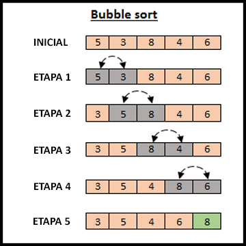

# BUBBLE SORT

Este algoritmo de ordenação tem como base, a ideia de **comparar reptidamente pares de elementos adjacentes, trocando-os quando estão na ordem incorreta**, reptidamente até todo vetor esteja ordenado.

O bubble sort funciona da seguinte maneira:

Compara os dois primeiros elementos **(Essa primeira comparação definirá a ordem à ser ordenado)**, em seguida compara o segundo elemento com o terceiro e assim sucessivamente, se na comparação os elementos estiverem fora de ordem faz a troca, senão pula para o proximo. Ah mas se nessas comparações alguns ficaram fora de ordem? O algoritmo se reptirá novamente desde do inicio, como podemos ver no exemplo abaixo.

